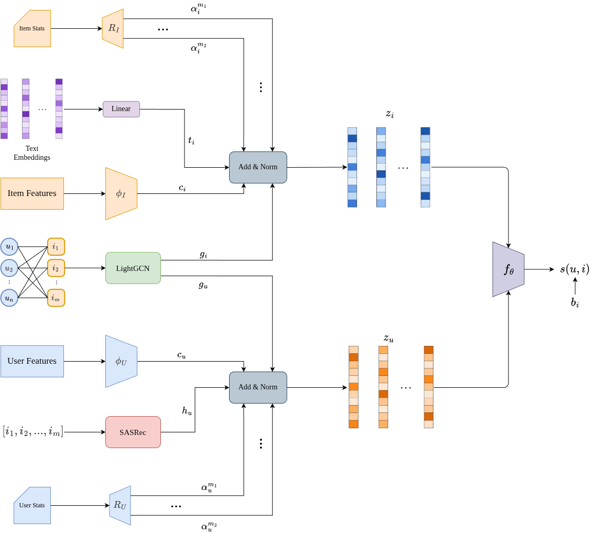

# EDuRec

EDuRec is a PyTorch Lightning recommendation system for e-learning datasets. It
combines collaborative graph signals, user and item side information, item text
representations, and sequential user history to recommend educational resources.

This repository is part of the Master's Thesis by Francisco de Paula Algar
Munoz at the Menendez Pelayo International University.

## Project Description

The project implements and evaluates a hybrid educational recommender for
implicit and explicit student-resource interactions. The codebase includes:

- Dataset loaders and preprocessing for `mars`, `itm`, and `doris`.
- The proposed EDuRec model, implemented with PyTorch, PyTorch Geometric, and
  Lightning.
- Training, testing, dataset inspection, hyperparameter optimization, benchmark
  evaluation, and ablation commands through a Typer CLI.
- RecBole-based comparisons against classical and state-of-the-art recommenders.
- Ranking metrics at multiple cutoffs, including Precision, Recall, NDCG, Hit
  Rate, MAP, and MRR.

## Installation

The project uses Python 3.12 or newer and [`uv`](https://docs.astral.sh/uv/) for
dependency management.

```bash
git clone https://github.com/Pacatro/EDuRec.git
cd EDuRec
uv sync
```

For development dependencies such as `pytest` and `wandb`, use:

```bash
uv sync --group dev
```

The repository expects raw datasets under `data/raw/<dataset>`. The included
loaders currently support:

- `data/raw/mars`
- `data/raw/itm`
- `data/raw/doris`

## Usage

All commands are exposed through the `edurec` CLI.

```bash
uv run edurec --help
```

Global options:

```text
-d, --device [auto|cpu|cuda]  Device to use
-r, --random-state INTEGER    Random seed
-v, --verbose                 Verbose output
-h, --help                    Show help
```

### Inspect a Dataset

Print basic statistics and sample rows from a dataset.

```bash
uv run edurec dataset --dataset mars --max_rows 10
```

Options:

```text
-d, --dataset [mars|itm|doris]  Dataset to use
-m, --max_rows INTEGER          Number of rows to show
```

### Train EDuRec

Train the proposed model on one dataset. If `--dataset` is omitted, the command
iterates through all registered datasets.

```bash
uv run edurec train --dataset mars --use_processed --save_model
```

Common options:

```text
-d, --dataset [mars|itm|doris]
-e, --epochs INTEGER            Default: 150
-l, --lr FLOAT                  Default: 0.0002
-b, --batch_size INTEGER        Default: 128
-p, --patience INTEGER          Default: 5
-v, --val_size FLOAT            Default: 0.1
-t, --test_size FLOAT           Default: 0.2
-k, --top_k INTEGER             Default: 20
-R, --remove_sparse             Remove sparse users/items
-i, --min_interactions INTEGER  Default: 3
-a, --adaptive_k                Use adaptive-k metrics where supported
-D, --debug                     Fast debug run
-S, --save_model                Save checkpoint, config, and metrics
-o, --optimize                  Run hyperparameter optimization first
-n, --trials INTEGER            Optimization trials, default: 30
-P, --use_processed             Reuse cached processed data
-M, --models-folder TEXT        Default: models
-C, --configs-folder TEXT       Default: configs
-E, --experiment-name TEXT      Optional logger experiment name
```

Example with optimization before the final training run:

```bash
uv run edurec train -d doris -P -S --optimize --trials 30
```

### Test a Saved Model

Load the most recent saved model for a dataset and evaluate it on the test
split.

```bash
uv run edurec test --dataset mars --use_processed
```

Options include dataset, batch size, validation/test split sizes, top-k,
adaptive-k, sparse filtering, and the models folder.

### Evaluate EDuRec and SOTA Models

Run the proposed EDuRec model and RecBole baselines on the selected dataset. If
`--dataset` is omitted, all datasets are evaluated.

```bash
uv run edurec eval --dataset itm --use-processed --top-k 5 --top-k 10 --top-k 20
```

Default SOTA models:

- `ItemKNN`
- `NeuMF`
- `LightGCN`
- `MultiVAE`
- `SGL`
- `SASRec`
- `BERT4Rec`

Useful options:

```text
-d, --dataset [mars|itm|doris]
-e, --epochs INTEGER            Default: 150
-l, --lr FLOAT                  Default: 0.0002
-b, --batch-size INTEGER        Default: 128
-p, --patience INTEGER          Default: 5
-k, --top-k INTEGER             Repeat for multiple cutoffs
-R, --remove-sparse / -K, --keep-sparse
-I, --min-interactions INTEGER  Default: 3
-P, --use-processed / -N, --no-use-processed
-c, --cfg-path FILE             Extra RecBole config
-m, --sota-model TEXT           Repeat to choose baseline models
-a, --adaptive-k / -A, --fixed-k
```

Results are written to `results/evaluations/<timestamp>/<dataset>/`, with one
artifact CSV per model and an aggregate `final_results.csv`.

### Optimize Hyperparameters

Run Optuna-based hyperparameter optimization for EDuRec.

```bash
uv run edurec optim --dataset mars --trials 30 --use_processed
```

The command saves the best configuration, trial log, and study database under
`results/optimization/<timestamp>/`.

### Run Ablations

Evaluate EDuRec variants across multiple random seeds.

```bash
uv run edurec ablation --dataset doris --seeds 13,42,77,101,2026 --use_processed
```

Implemented main variants:

- `base`: ID-only dot-product baseline.
- `full`: full EDuRec architecture.
- `no_graph`: removes LightGCN and graph contrastive learning.
- `no_features`: removes user, item, and text feature encoders.
- `no_sequence`: removes SASRec history encoding and context.
- `no_context`: keeps sequence modeling but removes contextual history features.
- `no_routers`: replaces routing networks with uniform module combination.
- `no_gcl`: removes graph contrastive learning.
- `dot_product`: replaces the MLP scorer with dot-product scoring.

Aggregated outputs are saved to `results/ablations/<dataset>/`.

## Model Architecture



EDuRec builds user and item representations from multiple complementary
modules:

- **Graph encoder**: a LightGCN-style encoder over the user-item interaction
  graph produces collaborative user and item embeddings.
- **Feature encoders**: MLP encoders transform dense and categorical user/item
  features into the shared embedding space.
- **Text projection**: preprocessed item text embeddings are projected into the
  same latent dimension as the other item modules.
- **Sequential encoder**: a SASRec-style Transformer encodes each user's recent
  item history, optionally enriched with interaction context features.
- **Routers**: small routing networks weight and combine the available user
  modules and item modules using user/item statistics.
- **Scorer**: the final user and item embeddings are scored with either an MLP
  scorer or a dot-product scorer. An optional item bias can be added.

Training uses cross-entropy over all candidate items. When enabled, graph
contrastive learning applies edge dropout to create two graph views and adds an
InfoNCE loss for user and item embeddings.

## Implemented Experiments

### Proposed Model Evaluation

`uv run edurec eval` trains EDuRec, evaluates the best checkpoint on the test
split, and reports Precision, Recall, NDCG, Hit Rate, MAP, and MRR at the
configured top-k values.

### SOTA Benchmark Evaluation

The same evaluation command exports RecBole atomic files and runs comparable
baseline models with aligned split files, metrics, learning rate, epoch count,
patience, batch size, and top-k settings.

### Hyperparameter Optimization

`uv run edurec optim` and `uv run edurec train --optimize` run Optuna studies for
EDuRec and save the best model configuration as YAML for later training or
ablation experiments.

### Ablation Study

`uv run edurec ablation` evaluates architecture variants across configurable
seeds and records metrics, parameter counts, and per-run configuration files.
This is intended to isolate the contribution of graph modeling, side features,
text features, sequential history, context, routing networks, graph contrastive
learning, and the scoring function.

## Author

[Francisco de Paula Algar Munoz](https://github.com/Pacatro)

## Advisors

Amelia Zafra Gomez

## License

This project is licensed under the MIT License. See [LICENSE](LICENSE) for
details.
