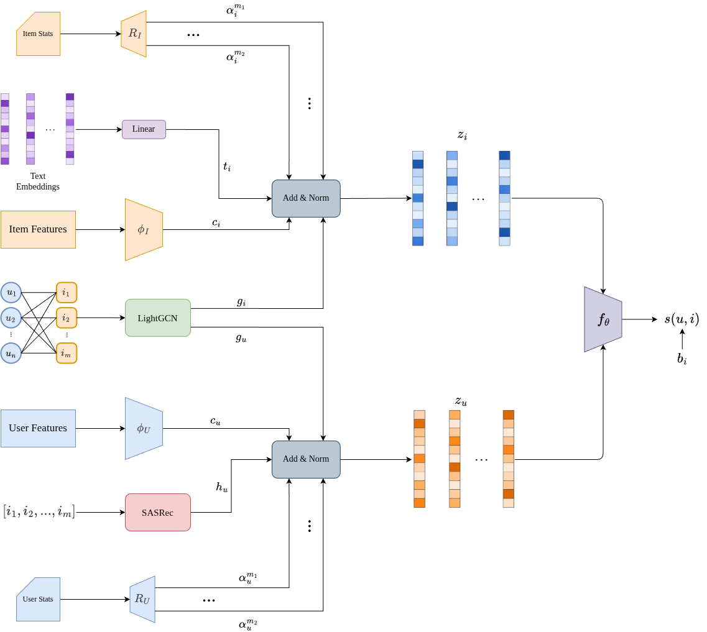

# EDuRec

EDuRec is a PyTorch Lightning recommendation system for e-learning datasets. It
combines a schema-derived knowledge graph, item text representations, and
sequential user history to recommend educational resources.

This repository is part of the Master's Thesis by Francisco de Paula Algar
Munoz at the Menendez Pelayo International University.

## Project Description

The project implements and evaluates a hybrid educational recommender for
implicit and explicit student-resource interactions. The codebase includes:

- Dataset loaders and preprocessing for `mars`, `itm`, and `doris`.
- The proposed EDuRec model, implemented with PyTorch, PyTorch Geometric, and
  Lightning.
- Training, testing, dataset inspection, hyperparameter optimization, benchmark
  evaluation, and ablation commands through a Typer CLI.
- RecBole-based comparisons against classical and state-of-the-art recommenders.
- Ranking metrics at multiple cutoffs, including Precision, Recall, NDCG, Hit
  Rate, MAP, and MRR.

## Installation

The project uses Python 3.12 or newer and [`uv`](https://docs.astral.sh/uv/) for
dependency management.

```bash
git clone https://github.com/Pacatro/EDuRec.git
cd EDuRec
uv sync
```

For development dependencies such as `pytest` and `mlflow`, use:

```bash
uv sync --group dev
```

The repository expects raw datasets under `data/raw/<dataset>`. The included
loaders currently support:

- `data/raw/mars`
- `data/raw/itm`
- `data/raw/doris`
- `data/raw/mooccubex`
- `data/raw/coco`

## Usage

All commands are exposed through the `edurec` CLI.

```bash
uv run edurec --help
```

Global options:

```text
-d, --device [auto|cpu|cuda]  Device to use
-r, --random-state INTEGER    Random seed
-v, --verbose                 Verbose output
-h, --help                    Show help
```

### Inspect a Dataset

Print basic statistics and sample rows from a dataset.

```bash
uv run edurec dataset --dataset explicit_mars --max_rows 10
```

Options:

```text
-d, --dataset [explicit_mars|implicit_mars|itm|doris|mooccubex|coco]  Dataset to use
-m, --max_rows INTEGER          Number of rows to show
```

### Train EDuRec

Train the proposed model on one dataset. If `--dataset` is omitted, the command
iterates through all registered datasets.

```bash
uv run edurec train --dataset explicit_mars --use_processed --save_model
```

Common options:

```text
-d, --dataset [explicit_mars|implicit_mars|itm|doris|mooccubex|coco]
-e, --epochs INTEGER            Default: from saved train config
-l, --lr FLOAT                  Default: from saved train config
-b, --batch_size INTEGER        Default: from saved train config
-p, --patience INTEGER          Default: from saved train config
-v, --val_size FLOAT            Default: 0.1
-t, --test_size FLOAT           Default: 0.2
-k, --top_k INTEGER             Default: 20
-R, --remove_sparse             Remove sparse users/items
-i, --min_interactions INTEGER  Default: 3
-a, --adaptive_k                Use adaptive-k metrics where supported
-D, --debug                     Fast debug run
-S, --save_model                Save checkpoint, config, and metrics
-P, --use_processed             Reuse cached processed data
-M, --models-folder TEXT        Default: models
-C, --configs-folder TEXT       Default: configs
-E, --experiment-name TEXT      Optional logger experiment name
```

KGSeq supports optional graph contrastive learning (GCL). Recommendation uses
the complete knowledge graph; two independently edge-dropped views regularize
the same HGT encoder during training only. Each edge is removed together with
its explicit reverse relation. The objective is the existing weighted
recommendation loss plus `gcl_weight * gcl_loss` (symmetric item InfoNCE).

```bash
uv run edurec --device cpu --random-state 42 train --dataset doris --arch kg_rnn --gcl-weight 0.01 --debug
```

Set these fields in `configs/model/config-<dataset>-kg_rnn.yaml`, or override
them with `--gcl-weight`, `--gcl-temperature`, `--gcl-edge-dropout`, and
`--gcl-max-items`:

```yaml
use_gcl: true
gcl_weight: 0.01
gcl_temperature: 0.2
gcl_edge_dropout: 0.1
gcl_max_items: 512
```

Set `use_gcl: false` to disable GCL while preserving its weight, temperature,
dropout, and anchor limit. Set it back to `true` to restore those settings.
The CLI flags `--gcl` / `--no-gcl` override the saved switch. A positive
`gcl_weight` is also required to run GCL.

GCL defaults to disabled (`gcl_weight: 0.0`) for compatibility with existing
experiments and checkpoints. Anchors are unique history items and training
targets, randomly capped by `gcl_max_items`; targets never enter the history
or graph structure. Training logs `train/rec_loss`, `train/gcl_loss`, and the
combined `train/Loss`. GCL adds two HGT passes per training batch; the anchor
cap bounds the contrastive matrix, not graph encoding. Validation and inference
use the complete graph and existing embedding cache. No data cache changes
are required. With `graph_mode: id`, GCL regularizes item representations
without structural augmentation.

### Test a Saved Model

Load the most recent saved model for a dataset and evaluate it on the test
split.

```bash
uv run edurec test --dataset explicit_mars --use_processed
```

Options include dataset, batch size, validation/test split sizes, top-k,
adaptive-k, sparse filtering, and the models folder.

### Evaluate EDuRec and SOTA Models

Run the proposed EDuRec model and RecBole baselines on the selected dataset. If
`--dataset` is omitted, all datasets are evaluated.

```bash
uv run edurec eval --dataset itm --use-processed --top-k 5 --top-k 10 --top-k 20
```

Default SOTA models:

- `ItemKNN`
- `NeuMF`
- `LightGCN`
- `MultiVAE`
- `SGL`
- `SASRec`
- `BERT4Rec`

Useful options:

```text
-d, --dataset [explicit_mars|implicit_mars|itm|doris|mooccubex|coco]
-e, --epochs INTEGER            Default: from saved train config
-l, --lr FLOAT                  Default: from saved train config
-b, --batch-size INTEGER        Default: from saved train config
-p, --patience INTEGER          Default: from saved train config
-k, --top-k INTEGER             Repeat for multiple cutoffs
-R, --remove-sparse / -K, --keep-sparse
-I, --min-interactions INTEGER  Default: 3
-P, --use-processed / -N, --no-use-processed
-c, --cfg-path FILE             Extra RecBole config
-m, --sota-model TEXT           Repeat to choose baseline models
-a, --adaptive-k / -A, --fixed-k
```

Results are written to `results/evaluations/<dataset>/`, with one CSV per model
and seed, the detailed `evaluation_results.csv`, and the aggregated
`evaluation_summary.csv`.

### Optimize Hyperparameters

Run Optuna-based hyperparameter optimization for EDuRec.

```bash
uv run edurec hpo --dataset explicit_mars --trials 30 --use_processed
```

The command saves the best model and training configurations, trial log, and
study database under `results/optimization/<dataset>/`. It also writes the best
configuration for each dataset and architecture to
`configs/model/config-<dataset>-<arch>.yaml` and
`configs/train/train-config-<dataset>-<arch>.yaml`, using the same file names as
the copies under `results/optimization/`, so they can be reused by training and
evaluation. Use `--configs-folder` to choose a different folder.

To keep the search affordable, each trial trains for at most `--search-epochs`
epochs, validates on a fraction of the validation split, and a Hyperband pruner
stops underperforming trials early. The winning configuration is saved with the
full `--epochs` budget for the final run.

### Saved Configurations

The `configs/` folder keeps one model configuration and one independent training
configuration per evaluated dataset **and architecture**:

```text
configs/model/config-<dataset>-<arch>.yaml         Model architecture hyperparameters
configs/train/train-config-<dataset>-<arch>.yaml   Training hyperparameters (epochs, lr,
                                                   batch size, patience, weight decay,
                                                   top-k, adaptive-k)
```

`<arch>` can be `kg_rnn` or `sasrec_text`. When a config file exists for the
dataset and architecture being run, training, evaluation, and ablation commands
load it. Explicit CLI flags always take precedence over the saved
configurations, which in turn take precedence over the global defaults in
`edurec/settings.py`.

The scorer is always an MLP over `concat(user_state, candidate_item_embedding)`.
Feature modules are toggled with `use_item_features`, `use_user_features`,
`use_interaction_features`, `use_time_features`, `use_attention_pooling`,
`graph_mode`, and `use_text_features`.

### Run Ablations

Evaluate EDuRec variants across multiple random seeds.

```bash
uv run edurec ablation --dataset doris --seeds 13,42,77,101,2026 --use_processed
```

Implemented main variants (all keep the item knowledge graph and the GRU):

- `item_kg`: item KG + GRU only.
- `item_kg_user`: adds the static user-profile initial state (`h0`).
- `item_kg_context`: adds the interaction context to each event.
- `item_kg_time`: adds the time-gap signal to each event.
- `full`: context + time + user profile (the default architecture).
- `attention_pooling`: `full` + optional attention pooling.
- `no_graph`: drops the knowledge-graph message passing, keeping only item ID
  embeddings and feature projections.
- `no_text`: removes the text embeddings from the item node features.
- `no_item_bias`: removes the learned item-popularity bias.

Variants that disable a module the dataset does not provide (for example
`no_text` on a dataset without text features) are marked as not applicable and
excluded from the plots. Aggregated outputs are saved to
`results/ablations/<dataset>/`.

## Model Architecture



EDuRec exposes `kg_rnn` through the `arch` field of the model configuration. It
refines item embeddings with a relation-aware item knowledge graph and encodes
each user's chronological history with a GRU/LSTM. Each historical event is the
sum of its item embedding, its interaction context and its time gap, the user
profile initialises the recurrent state, and an MLP scores user/candidate
pairs.

The sections below describe the modules.

The `sasrec_text` architecture implements a content-enhanced SASRec:
`course_emb = ID embedding + projected content features`. Content features reuse
the preprocessing pipeline's frozen pretrained text embeddings (text fields
are joined with their field names) and numeric course metadata. Both history
and candidates use the same course embedding table. A causal Transformer with
learned positions produces the user state from the last valid history position;
dot products with candidates produce scores for Top-K ranking. Graph, user
profile, attention pooling, and item bias are disabled for this architecture.
Empty histories produce a zero state and tied scores. If no content features
are available, the model uses course ID embeddings alone. Only `full` and
`no_text` (when text is available) apply in the ablation command.

```bash
uv run edurec train --dataset doris --arch sasrec_text
```

Use the existing `transformer_hidden_dim`, `transformer_layers`,
`transformer_heads`, `max_history_len`, `emb_dim`, and `dropout` model settings.

- **Item knowledge graph encoder**: a heterogeneous item-only graph is derived
  from each dataset schema. Items are nodes, and every categorical or
  list-valued item field becomes an attribute node type. Relation direction is
  preserved: each forward edge type gets an explicit reverse edge type with a
  distinct `rev_` name (for example `ref::prerequisites` and
  `rev_ref::prerequisites`) instead of a blind symmetrisation. Extra relations
  are declared per dataset in the schema: `refs` links fields whose values name
  another entity (for example DORIS course prerequisites) and `cooc` links two
  attributes that co-occur in a row (for example COCO category levels). The
  graph is encoded by a stacked `HGTConv` (Heterogeneous Graph Transformer)
  with residual connections and LayerNorm; the number of layers, heads and
  dropout are configurable. Numeric and text embeddings initialise the item
  nodes.
- **Sequential encoder**: each history event is
  `LayerNorm(item_emb[t] + context[t] + time[t])`, where the interaction context
  comes from the preprocessed interaction features (rating, numeric,
  categorical, precomputed text embeddings) and the time signal is
  `Linear(log1p(delta_t))`. The static user profile is projected into the GRU's
  initial hidden state `h0`; the default user state is the last valid hidden
  state (attention pooling is an optional ablation). Missing signals are simply
  omitted.
- **Scorer**: an MLP over `concat(user_state, candidate_item_embedding)`. Full
  catalog scoring is chunked to bound memory. An optional item bias can be
  added.

### Leakage prevention

User-item interactions never enter the knowledge graph: `build_knowledge_graph`
does not accept interactions at all, so target/validation/test information
cannot leak into message passing. The item-item relations (`refs`, `cooc`) are
computed from static item metadata; if an interaction-derived relation (for
example item co-occurrence) is ever added it must be computed from the training
split only. Histories are built strictly chronologically and a row's own event
is never part of its own history (history, interaction context and timestamps
are aligned per step and only contain earlier events). Interaction features are
fitted on the training split by the `DataProcessor`.

Repeated `(user, item)` rows are preserved by default
(`deduplicate_interactions: false`) so real temporally-distinct events (view ->
progress -> complete) remain distinct. Datasets without a timestamp are always
deduplicated to avoid leakage across a random split; set
`deduplicate_interactions: true` to force deduplication.

Module availability is inferred from each processed dataset when the model
configuration is built. The knowledge graph automatically reflects the fields
declared by each dataset schema. Sequential history requires a real
chronological interaction field; datasets without one cannot train the model.

## Implemented Experiments

### Proposed Model Evaluation

`uv run edurec eval` trains EDuRec, evaluates the best checkpoint on the test
split, and reports Precision, Recall, NDCG, Hit Rate, MAP, and MRR at the
configured top-k values.

### SOTA Benchmark Evaluation

The same evaluation command exports RecBole atomic files and runs the baseline
models with aligned split files, learning rate, epoch count, patience, batch
size, and top-k settings. Sequential baselines receive prebuilt histories for
the original train, validation, and test splits instead of asking RecBole to
split the merged interaction file again.

Final ranking metrics use one shared evaluator for every model. Each positive
test interaction is one query with one target, and EDuRec and the RecBole
baselines use the same full item catalog, seen-item mask, and TorchMetrics
implementations for Precision, Recall, NDCG, Hit Rate, MAP, and MRR.

### Hyperparameter Optimization

`uv run edurec hpo` runs Optuna studies for EDuRec and saves the best model
and training configurations as YAML for later training, evaluation, or ablation
experiments.

### Ablation Study

`uv run edurec ablation` evaluates architecture variants across configurable
seeds and records metrics, parameter counts, and per-run configuration files.
This is intended to isolate the contribution of the knowledge-graph structure,
text features, item bias, and the scoring function.

## Author

[Francisco de Paula Algar Munoz](https://github.com/Pacatro)

## Advisors

Amelia Zafra Gomez

## License

This project is licensed under the MIT License. See [LICENSE](LICENSE) for
details.
